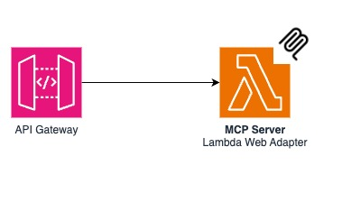

# FastMCP + API Gateway + Lambdaで、Remote MCP Serverを構築する

## はじめに

本記事では、AWSのAPI GatewayとLambdaを使って、サーバレスなRemote MCP Serverを構築する方法を紹介します。
API Gatewayを使うことでより柔軟なセキュリティ設定、ルーティングが可能になります。

## 前提条件

- AWSの基本的な知識
- AWSアカウントの作成
- AWS SAM CLIのインストール
- Pythonに関する基本的な知識
- MCPの基本的な知識

## アーキテクチャ

このシステムのアーキテクチャは以下の通りです：



```text
MCP Client → API Gateway → Lambda (+ Lambda Web Adapter) → FastMCP Server
```

Lambda Web Adapterを使用し、FastMCPをFastAPIにマウントし、HTTPサーバとしてLambdaで実行します。
API Gatewayがリクエストを受け取り、Lambdaに転送、Lambdaが応答を返すという流れになります。

## 実装方法

### 1. プロジェクト構成

```text
serverless-mcp-server-with-apigateway/
├── README.md
├── template.yaml  # SAMテンプレート
└── src/
    ├── app/
    │   ├── __main__.py
    │   └── main.py  # MCPサーバの実装
    └── run.sh       # Lambdaのエントリポイント
```

### 2. MCPサーバの実装 (main.py)

MCPサーバは[fastmcp](https://github.com/jlowin/fastmcp)を使用して実装します。
このライブラリは、[MCP公式Pthon-SDK](https://github.com/modelcontextprotocol/python-sdk)の
後継ライブラリであり、FastAPIベースのMCPサーバを簡単に作成できます。

```python
from fastmcp import FastMCP

mcp = FastMCP(stateless_http=True, json_response=True)

@mcp.tool()
def add(a: int, b: int) -> int:
    """
    Add two integers.
    """
    return a + b

@mcp.tool()
def multiply(a: int, b: int) -> int:
    """
    Multiply two integers.
    """
    return a * b

app = mcp.http_app()
```

ここでは、シンプルな足し算と掛け算のツールを実装しています。実際のプロジェクトでは、もっと複雑なツールを追加できます。

重要なのは、`stateless_http=True`を設定している点です。
これにより、Lambdaのようなステートレスな環境でも問題なく動作するようにしています。
また、`json_response=True`を設定することで、MCPのレスポンスをSSEではなく、JSON形式で返すようにしています。
これにより、ストリームレスポンスに対応していないAPI Gatewayでも問題なく動作します。

### 3. エントリポイントの設定 (__main__.py)

ローカルでの開発時に使用するエントリポイントを設定します。
`uvicorn`を使ってFastAPIアプリケーションを起動します。

```python
from .main import app

if __name__ == "__main__":
    import uvicorn

    uvicorn.run(app, port=8080, log_level="critical", server_header=False)
```

### 4. Lambda実行スクリプト (run.sh)

Lambdaで実行するためのシェルスクリプトです。Lambda Web Adapterがこのスクリプトを呼び出します。

```bash
#!/bin/bash
python -m app
```

### 5. SAMテンプレート (template.yaml)

AWS SAMを使ってインフラをコード化します。Lambda Web Adapterのレイヤーを含め、必要な設定を行います。

```yaml
AWSTemplateFormatVersion: 2010-09-09
Transform:
  - AWS::Serverless-2016-10-31
  - AWS::LanguageExtensions

Resources:
  Function:
    Type: AWS::Serverless::Function
    Properties:
      Architectures:
        - arm64
      Runtime: python3.13
      Timeout: 30
      AutoPublishAlias: live
      Layers:
        - !Sub arn:aws:lambda:${AWS::Region}:753240598075:layer:LambdaAdapterLayerArm64:18
      MemorySize: 1024
      CodeUri: src
      Handler: run.sh
      Events:
        apiReport:
          Type: Api
          Properties:
            Path: /{proxy+}
            Method: ANY
      Environment:
        Variables:
          AWS_LAMBDA_EXEC_WRAPPER: /opt/bootstrap
          PORT: 8080

Outputs:
  Api:
    Description: "API Gateway endpoint URL for Prod stage for Function"
    Value: !Sub "https://${ServerlessRestApi}.execute-api.${AWS::Region}.amazonaws.com/Prod/mcp"
  Function:
    Description: "Lambda Function ARN"
    Value: !GetAtt Function.Arn
  FunctionIamRole:
    Description: "Implicit IAM Role created for Function"
    Value: !GetAtt FunctionRole.Arn
```

ポイントは以下の通りです：

- Lambda Web Adapterのレイヤーを指定
- ハンドラとして`run.sh`を指定
- 環境変数で`AWS_LAMBDA_EXEC_WRAPPER`と`PORT`を設定
- API Gatewayのイベントソースを設定

## デプロイ方法

AWS SAM CLIを使ってデプロイします。

```bash
# ビルド
sam build

# デプロイ
sam deploy --guided
```

初回は`--guided`オプションを付けて対話的に設定を行います。2回目以降は単に`sam deploy`でOKです。

デプロイが完了すると、API GatewayのエンドポイントURLが表示されます。これがMCPサーバのURLになります。

## 使い方

### クライアントからの接続

Streamable HTTPに対応したMCP ClientのURLを出力されたURLに変更すれば、AWS Lambdaで動作するRemote MCP Server接続できます。

`https://${ServerlessRestApi}.execute-api.${AWS::Region}.amazonaws.com/Prod/mcp/`

## まとめ

API GatewayとLambda Web Adapterを使うことで、サーバレスなRemote MCP Serverを簡単に構築できます。

サーバレスアーキテクチャでRemote MCP Serverを構築することで、柔軟でスケーラブルなAIツール連携基盤を実現できます。
また、API Gatewayを使用することで、認証やルーティングなどの機能もFuntion URLsよりも柔軟に設定できます。

## Function URLsとの主な違い

### メリット

- API Gatewayの機能を活用できる
  - 認証
  - モニタリング
  - ルーティング

### デメリット

- ストリームレスポンスに対応していない  
- 実行時間が30秒に制限されている

その他のFunction URLsとAPI Gatewayの違いについては、以下の記事をご参考ください。

https://serverless.co.jp/blog/j94zz_4-m/

## 参考

https://gofastmcp.com/deployment/asgi#running-the-server

https://github.com/huanshenyi/serverless-mcp-servers-cdk