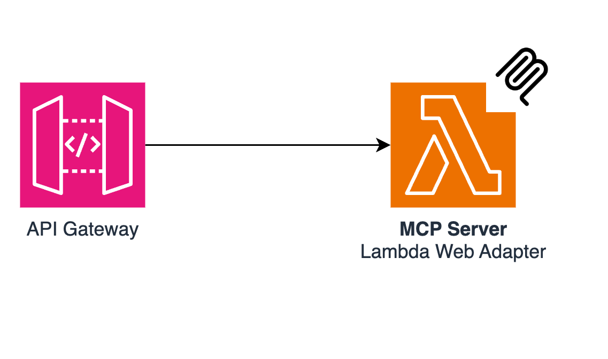

# Building a Remote MCP Server with FastMCP + API Gateway + Lambda

## Introduction

This article introduces how to build a serverless Remote MCP Server using AWS API Gateway and Lambda.
Using API Gateway enables more flexible security settings and routing.

## Prerequisites

- Basic knowledge of AWS
- Creation of an AWS account
- Installation of AWS SAM CLI
- Basic knowledge of Python
- Basic knowledge of MCP

## Architecture

The architecture of this system is as follows:



```text
MCP Client → API Gateway → Lambda (+ Lambda Web Adapter) → FastMCP Server
```

We use Lambda Web Adapter to mount FastMCP on FastAPI and run it as an HTTP server on Lambda.
API Gateway receives requests, forwards them to Lambda, and Lambda returns responses.

## Implementation Method

### 1. Project Structure

```text
serverless-mcp-server-with-apigateway/
├── README.md
├── template.yaml  # SAM template
└── src/
    ├── app/
    │   ├── __main__.py
    │   └── main.py  # MCP server implementation
    └── run.sh       # Lambda entry point
```

### 2. MCP Server Implementation (main.py)

The MCP server is implemented using [fastmcp](https://github.com/jlowin/fastmcp).
This library is the successor to the [MCP official Python-SDK](https://github.com/modelcontextprotocol/python-sdk)
and allows for easy creation of FastAPI-based MCP servers.

```python
from fastmcp import FastMCP

mcp = FastMCP(stateless_http=True, json_response=True)

@mcp.tool()
def add(a: int, b: int) -> int:
    """
    Add two integers.
    """
    return a + b

@mcp.tool()
def multiply(a: int, b: int) -> int:
    """
    Multiply two integers.
    """
    return a * b

app = mcp.http_app()
```

Here, we implement simple addition and multiplication tools. In actual projects, you can add more complex tools.

It's important to note that we set `stateless_http=True`. This ensures it works properly in stateless environments like Lambda.
Also, by setting `json_response=True`, MCP responses are returned in JSON format rather than SSE.
This allows it to work properly with API Gateway, which doesn't support stream responses.

### 3. Setting the Entry Point (__main__.py)

We set up an entry point for local development.
We use `uvicorn` to start the FastAPI application.

```python
from .main import app

if __name__ == "__main__":
    import uvicorn

    uvicorn.run(app, port=8080, log_level="critical", server_header=False)
```

### 4. Lambda Execution Script (run.sh)

This is a shell script for execution in Lambda. Lambda Web Adapter calls this script.

```bash
#!/bin/bash
python -m app
```

### 5. SAM Template (template.yaml)

We use AWS SAM to codify the infrastructure. This includes the Lambda Web Adapter layer and other necessary configurations.

```yaml
AWSTemplateFormatVersion: 2010-09-09
Transform:
  - AWS::Serverless-2016-10-31
  - AWS::LanguageExtensions

Resources:
  Function:
    Type: AWS::Serverless::Function
    Properties:
      Architectures:
        - arm64
      Runtime: python3.13
      Timeout: 30
      AutoPublishAlias: live
      Layers:
        - !Sub arn:aws:lambda:${AWS::Region}:753240598075:layer:LambdaAdapterLayerArm64:18
      MemorySize: 1024
      CodeUri: src
      Handler: run.sh
      Events:
        apiReport:
          Type: Api
          Properties:
            Path: /{proxy+}
            Method: ANY
      Environment:
        Variables:
          AWS_LAMBDA_EXEC_WRAPPER: /opt/bootstrap
          PORT: 8080

Outputs:
  Api:
    Description: "API Gateway endpoint URL for Prod stage for Function"
    Value: !Sub "https://${ServerlessRestApi}.execute-api.${AWS::Region}.amazonaws.com/Prod/mcp"
  Function:
    Description: "Lambda Function ARN"
    Value: !GetAtt Function.Arn
  FunctionIamRole:
    Description: "Implicit IAM Role created for Function"
    Value: !GetAtt FunctionRole.Arn
```

The key points are as follows:

- Specifying the Lambda Web Adapter layer
- Specifying `run.sh` as the handler
- Setting environment variables for `AWS_LAMBDA_EXEC_WRAPPER` and `PORT`
- Configuring the API Gateway event source

## Deployment Method

Deploy using AWS SAM CLI.

```bash
# Build
sam build

# Deploy
sam deploy --guided
```

For the first time, use the `--guided` option to configure interactively. For subsequent deployments, simply use `sam deploy`.

Once deployment is complete, the API Gateway endpoint URL will be displayed. This becomes the URL for your MCP server.

## Usage

### Connecting from a Client

Change the URL of your Streamable HTTP-compatible MCP Client to the output URL to connect to the Remote MCP Server running on AWS Lambda.

`https://${ServerlessRestApi}.execute-api.${AWS::Region}.amazonaws.com/Prod/mcp/`

## Summary

Using API Gateway and Lambda Web Adapter, you can easily build a serverless Remote MCP Server.

By building a Remote MCP Server with serverless architecture, you can achieve a flexible and scalable AI tool integration platform.
Additionally, using API Gateway allows for more flexible configuration of features such as authentication and routing compared to Function URLs.

## Main Differences from Function URLs

### Advantages

- Can utilize API Gateway features
  - Authentication
  - Monitoring
  - Routing

### Disadvantages

- Does not support stream responses
- Execution time is limited to 30 seconds

For other differences between Function URLs and API Gateway, please refer to the following article:

https://serverless.co.jp/blog/j94zz_4-m/

## References

https://gofastmcp.com/deployment/asgi#running-the-server

https://github.com/huanshenyi/serverless-mcp-servers-cdk.